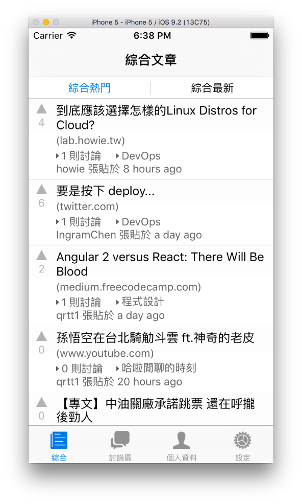
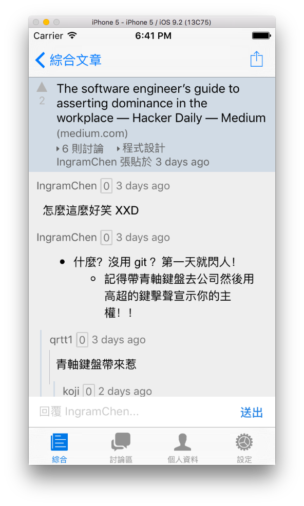
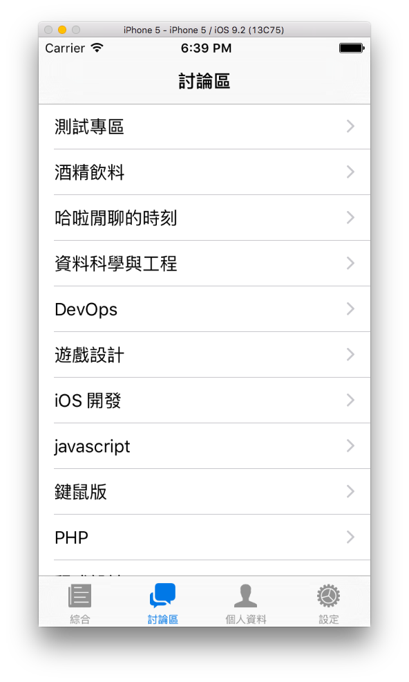
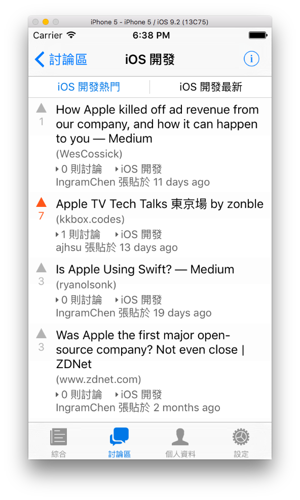

# Kaif.io iOS Client App
[Kaif.io](https://kaif.io) unofficial iOS Client App. Made with React Native.

## Screenshots





## Setup

### React Native

```bash
npm install
cp src/config/config.sample.js src/config/config.js
```

然後在 `config.js` 填入在 [kaif client apps](https://kaif.io/developer/client-app) 新增應用程式的 `client id` 還有 `client secret`，最後：

```bash
npm start
```

會跑起 react native 的 packager。接下來我們要設定 Xcode的部分。

### Xcode
打開 `ios` 資料夾理的 `KaifIoIos.xcodeproj`，更改 bundle identifier（如果要的話）、fix issues（如果要的話）。Build and Run!

## Development

要進行開發的話把 `AppDelegate.m` 裡 47 行的

```objective-c
jsCodeLocation = [[NSBundle mainBundle] URLForResource:@"main" withExtension:@"jsbundle"];
```

註解掉，然後工具列的 `Product` => `Scheme` => `Edit Scheme...` 點進去，把 `Build Configuration` 改成 `Release`。

一樣跑起 `npm start`，Build and Run!
