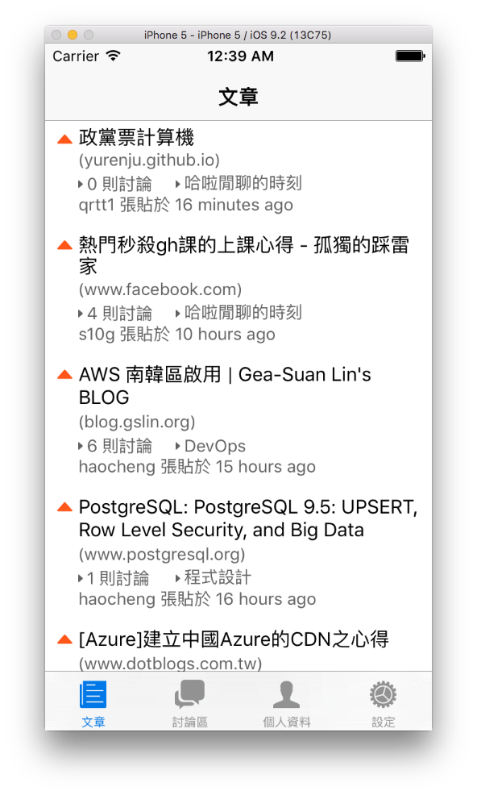

# Kaif.io React Native iOS App(At a very early stage)
[Kaif.io](https://kaif.io) unofficial iOS Client App.

## Screenshots



## Setup

```bash
npm install
cp src/config/config.sample.js src/config/config.js # and edit corresponding fields.
npm start
```
